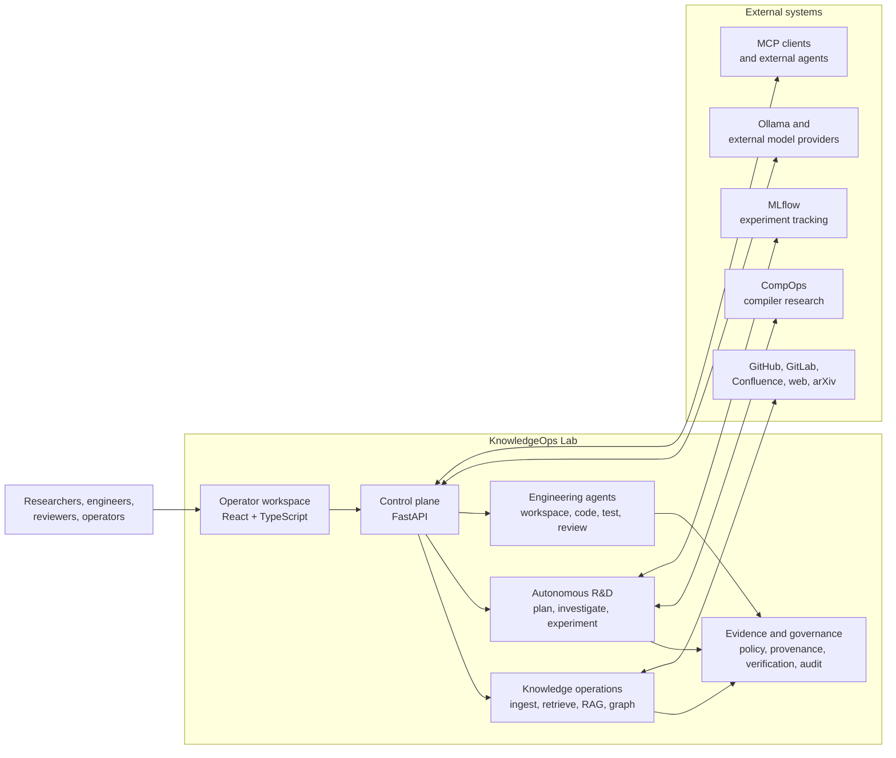
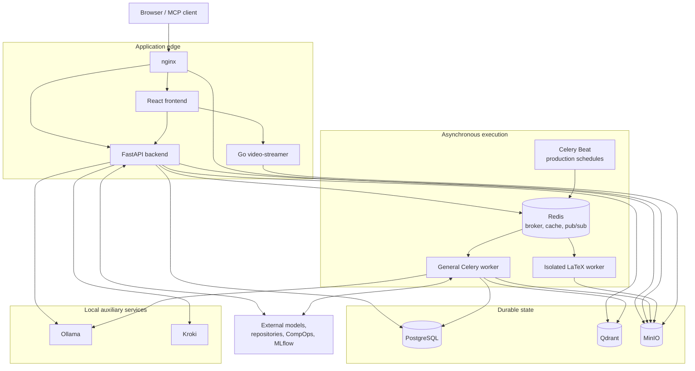
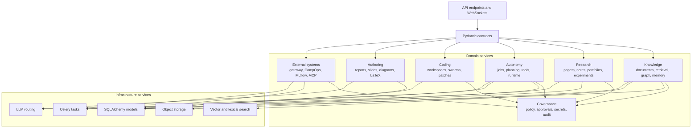
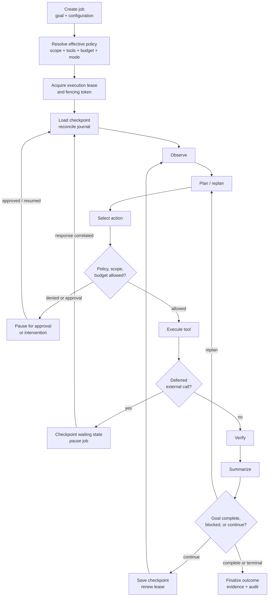
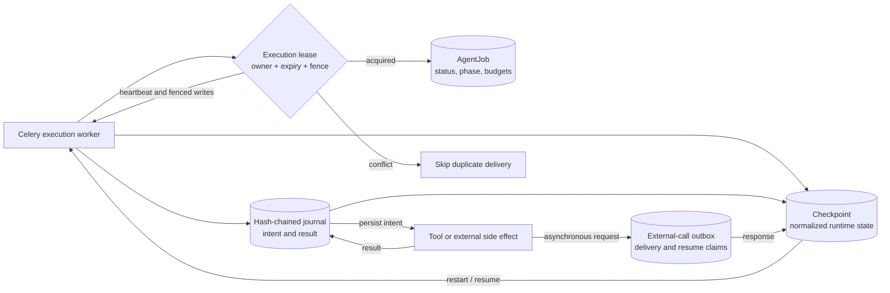
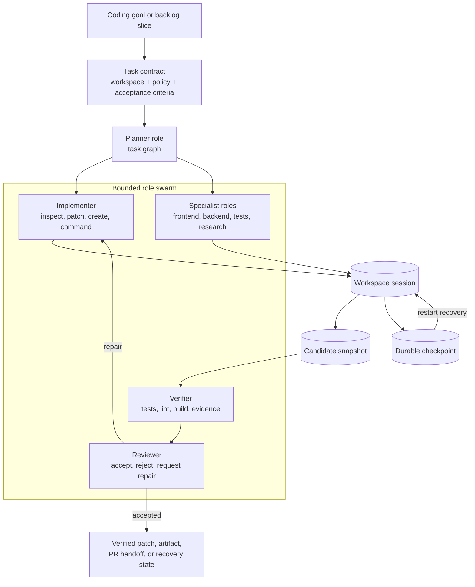
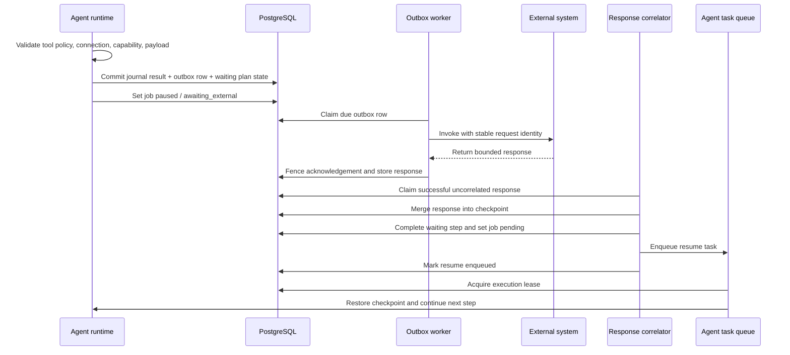
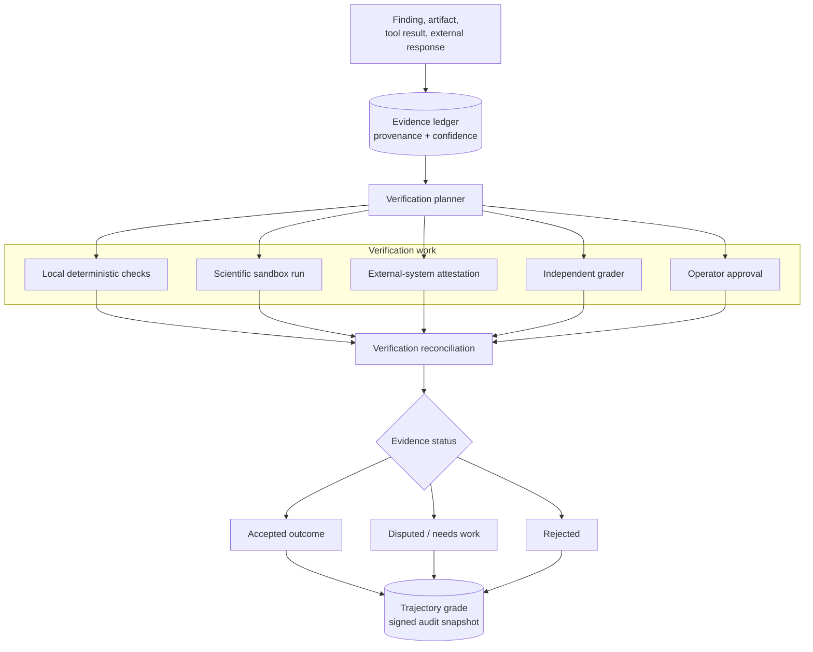
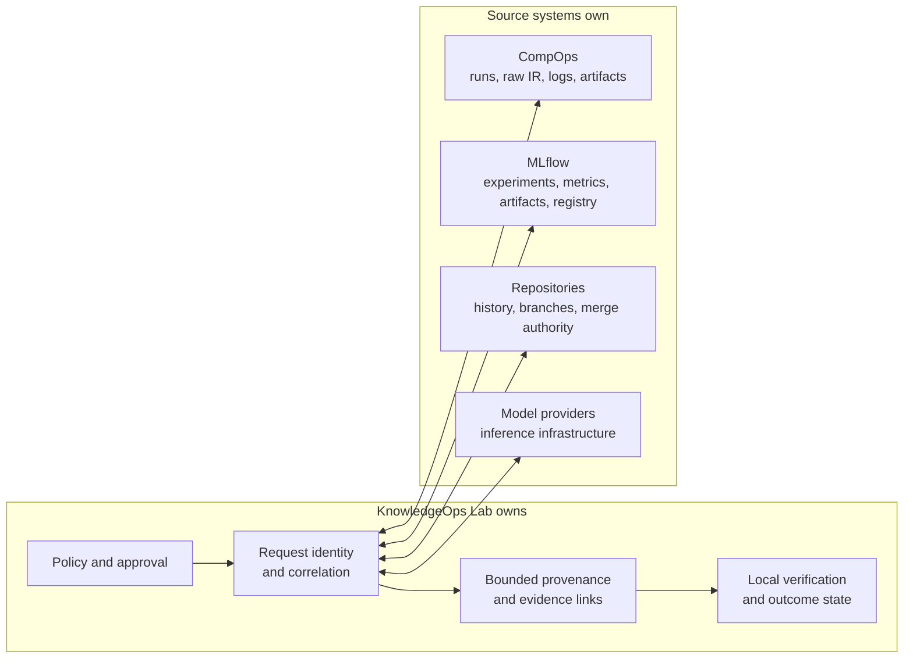

# KnowledgeOps Lab Architecture Diagrams

These Mermaid diagrams complement the canonical
[text architecture](ARCHITECTURE_ASCII.md). They intentionally show stable
subsystem boundaries instead of file, endpoint, model, or migration counts.

GitHub renders Mermaid inline. The local development stack also includes Kroki
at `http://localhost:8001`.

## 1. Product context

## 2. Deployment topology

## 3. Backend subsystem map

## 4. Autonomous R&D runtime

## 5. Durable execution and recovery

The mechanisms have different jobs: leases arbitrate ownership, fencing rejects
stale owners, journal entries reconcile partial calls, checkpoints restore
runtime state, and the outbox bridges transactions with asynchronous systems.

## 6. Coding harness and swarm

## 7. External call, correlation, and resume

Delivery is retryable and idempotent. The task queue can provide at-least-once
delivery; the resume marker and execution lease prevent duplicate active
execution.

## 8. Evidence verification

## 9. External-system ownership

KnowledgeOps Lab stores enough local state to reproduce decisions and audit
provenance without silently becoming the system of record for every remote
artifact.

For a compact presentation view, use
[the single-slide Mermaid map](knowledgeops_architecture_slide.mmd).
