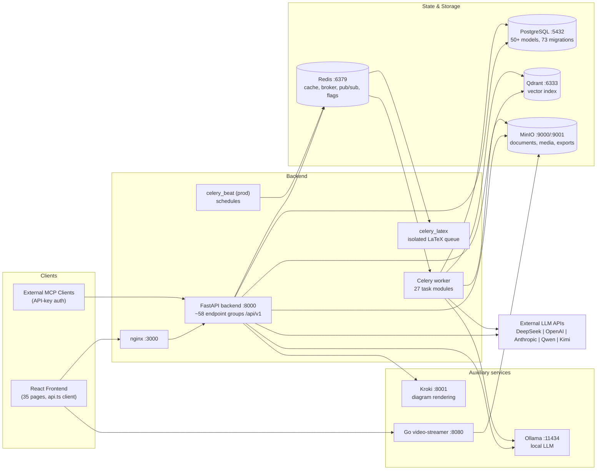
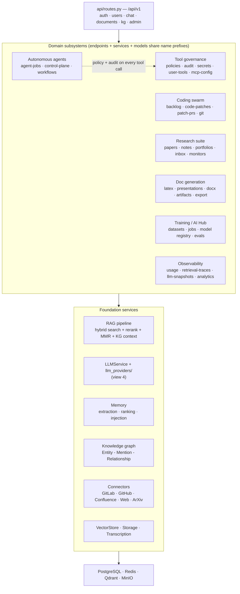
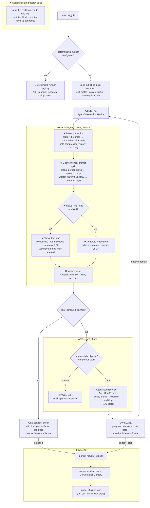
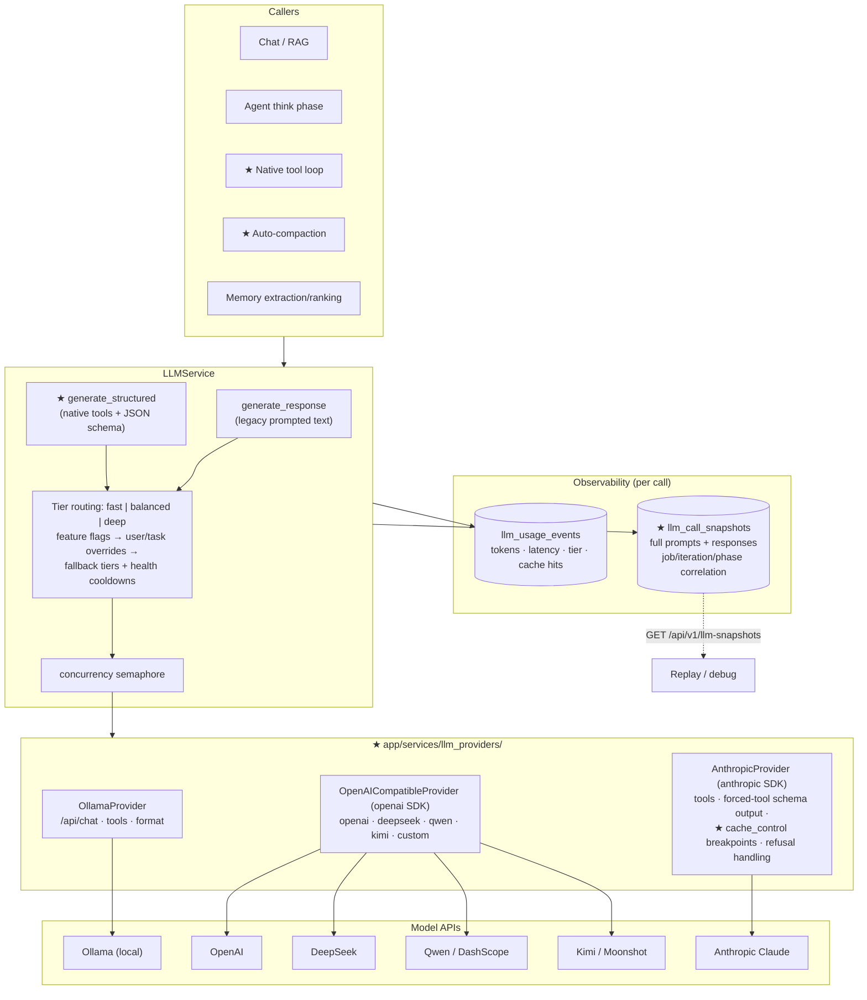

# KnowledgeDBChat — Architecture Diagrams

Implementation-faithful visual map of the system as it exists today. Four
views, from the outside in: deployment, backend subsystems, the autonomous
agent runtime, and the LLM provider stack.

Diagrams are Mermaid — GitHub renders them inline; locally use the Kroki
service (`http://localhost:8001`) or any Mermaid renderer.

---

## 1. Deployment view (docker-compose services)

---

## 2. Backend subsystem view

---

## 3. Autonomous agent runtime (one job)

The observe→think→act→evaluate loop with the current think-phase pipeline.
Items marked ★ are recent additions.

---

## 4. LLM provider stack & observability

**Key properties encoded above**

- Every tool an agent executes — whether via the classic act phase or the
  native tool loop — passes through the same dispatch: policy engine →
  execution → audit log. Approval-gated and dangerous tools always route
  back to the act phase's pause-for-approval machinery.
- The think-phase system prompt is byte-stable per job; all per-iteration
  context rides in the user message. On Anthropic this makes the prefix a
  cache read (~0.1× cost) from iteration 2 onward; OpenAI/DeepSeek prefix
  caching engages automatically.
- Both LLM paths share tier routing, provider health cooldowns, usage
  accounting, and (opt-in) full call snapshots keyed by job/iteration/phase.
- The golden-task suite (`tests/test_golden_agent_tasks.py`) exercises the
  real loop in view 3 with only the LLM and tool seams scripted — it is the
  regression gate for changes to any starred component.
